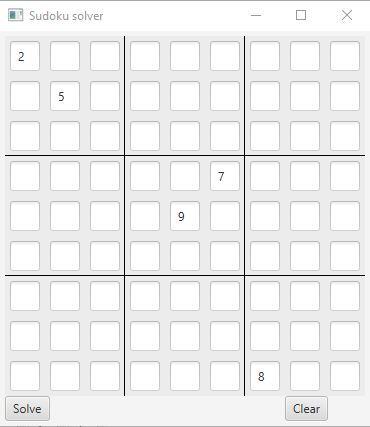
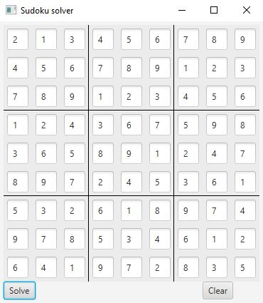
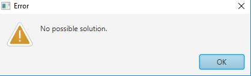

# Sudoku solver

### Build

> **./gradlew build**

### Run

> **./gradlew run**

### How to use

Fill in the known values and press `Solve`.

When the solution is found the board will be updated.

If the board is unsolvable an error message will appear.

